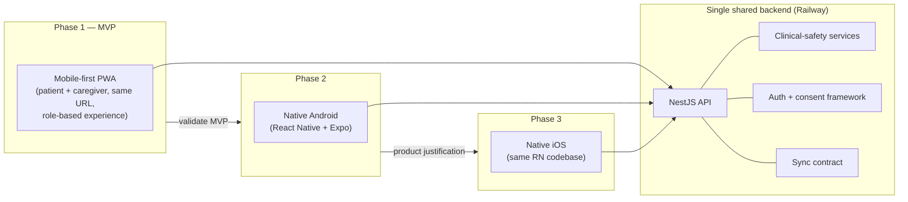

# 03 — Client Delivery and Phased Rollout

## Phasing

## Phase 1 — Mobile-first PWA (this MVP)

Works directly in a mobile browser at `https://app.example.com`; no installation required; optional add-to-home-screen. Full requirements in [07-pwa-screen-specifications](07-pwa-screen-specifications.md) and [12-system-architecture](12-system-architecture.md). Capabilities: manifest + service worker, responsive touch-first layouts, camera prescription capture, microphone/voice input and text-to-speech where the browser allows, limited offline use, safe local storage, browser notifications with SMS/WhatsApp fallback, low-bandwidth operation, Android phones / iPhones / tablets / desktop.

**Gate to Phase 2:** MVP validated against [04-mvp-and-roadmap](04-mvp-and-roadmap.md) success metrics — especially the primary metric: patients can safely and easily use the product from a browser.

## Phase 2 — Native Android (Stage 9)

React Native + Expo app in `apps/mobile-native` (placeholder during MVP). Adds what browsers can't reliably provide: dependable medication reminders and native push, background sync, biometric authentication, encrypted device storage, better camera/image processing, accessibility integration, deep/app links, device-level security, future health-platform integrations. Details in [08-native-mobile-roadmap](08-native-mobile-roadmap.md).

**Hard constraints:** uses the same Railway backend APIs; contains **no separate or conflicting medication-safety logic**.

## Phase 3 — Native iOS (Stage 10)

Added when adoption and business needs justify it. Same backend APIs, domain model, clinical-rule service, auth + consent framework, sync contract; equivalent accessibility and privacy requirements.

## Shared client strategy

Shared across web and native via monorepo packages ([20 in spec → repo layout in 12-system-architecture](12-system-architecture.md)):

| Shared element | Package |
|---|---|
| TypeScript domain types | `packages/domain` |
| API client | `packages/api-client` |
| Validation schemas | `packages/validation` |
| Localization keys | `packages/localization` |
| Clinical-alert presentation rules | `packages/clinical-rules` (presentation constants only — evaluation is server-side) |
| Design tokens, icons | `packages/design-tokens` |
| Analytics-event and audit-event definitions | `packages/domain` |
| Feature flags, error models | `packages/config`, `packages/domain` |
| Offline mutation formats | `packages/offline-sync` |

**Not shared:** full UI code, when sharing would weaken accessibility or platform-native UX. Web uses `packages/ui-web`; native will get its own component layer.

## Rules that hold across all phases

- One backend, one domain model, one clinical-safety service, one auth/consent framework, one sync contract.
- The PWA remains fully supported after native apps ship — installation is never required for patient access.
- Native development does not begin until the PWA foundation and APIs are stable, unless a critical requirement cannot be met through the PWA (documented as an ADR in [24-open-decisions-and-assumptions](24-open-decisions-and-assumptions.md)).
