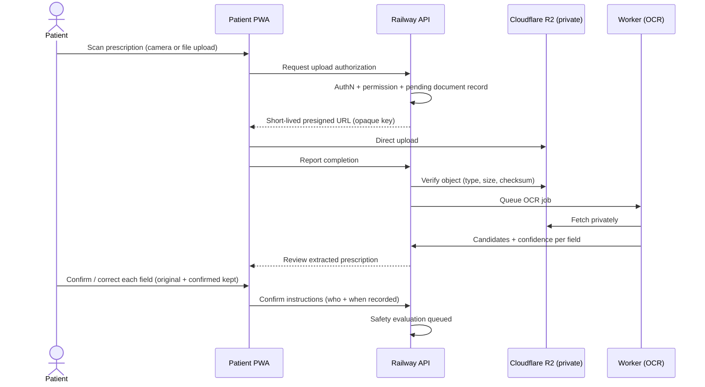

# 05 — User Journeys

Screens referenced here are specified in [07-pwa-screen-specifications](07-pwa-screen-specifications.md).

## J1 — First-time onboarding (Lakshmi, P1)

1. Opens `app.example.com` from a link her son sent → **Welcome** (works instantly, nothing to install).
2. **Language selection** (Telugu) → **OTP login** (mobile number, 6-digit OTP; Turnstile on suspicious traffic).
3. **Create patient profile** (name, year of birth, optional allergies/conditions with skip).
4. Home shows empty state with two big actions: "Add medicine" / "Scan prescription".
5. Optional, dismissible **add-to-home-screen education** — the site keeps working either way.

## J2 — Medication capture via prescription photo (Fatima, P3)

Rules: no extracted value is treated as clinically confirmed until the patient (or caregiver) confirms it; ambiguous abbreviations (1-0-1, OD, BD, TDS, SOS, HS…) show detected value + plain-language interpretation + confidence and require confirmation; originals preserved forever.

## J3 — Daily adherence (Ravi, P4, intermittent connectivity)

1. Morning: opens PWA offline → cached **Today's medication timeline** renders with "Offline — changes will sync" banner.
2. Taps "Taken" on two medicines → dose events queued locally with idempotent mutation IDs.
3. Network returns → background sync (or next app open) flushes queue; status shows "Last synced just now".
4. Evening dose missed → next open shows **Missed-dose state** with approved missed-dose guidance only (never invented) and "Contact your doctor if unsure".

## J4 — Duplicate ingredient caught (Lakshmi, P1)

1. Adds "Brand X" prescribed by a new doctor.
2. Safety evaluation (server-side) finds Brand X and her existing "Brand Y" both contain metformin.
3. **Duplicate ingredient warning**: "Possible duplicate ingredient… This may have been prescribed intentionally… Do not stop or change your medicine based only on this alert. Please confirm with your doctor or pharmacist." Both medicines shown with evidence source and next actions (call doctor / mark as reviewed with note).
4. Finding stays visible in "Concerns" until resolved; resolution is audited.

## J5 — Caregiver management (Arjun, P2)

1. Arjun's mother (or Arjun on her phone, with her consent) opens **Caregiver permissions** → invites Arjun by mobile number with scopes: view medications, view schedule, manage reminders, record doses.
2. Arjun accepts on his own account; the relationship is patient-specific, time-boundable, revocable; every grant/use is audited.
3. Arjun records her evening dose remotely; the audit trail shows who recorded it.
4. Mother revokes "record doses" later — backend enforcement means Arjun's next attempt is rejected server-side, not just hidden.

## J6 — Doctor visit (Lakshmi + Dr. Mehta, P5)

1. **Doctor-visit mode**: identity, allergies, conditions, current medicines with ingredients/doses/schedules/prescribers/start dates, recently stopped/completed, recent changes, adherence summary, unresolved concerns, prescription images (if permitted).
2. Lakshmi shares via QR; Dr. Mehta scans → time-limited, no-store, audited share page; optional one-time verification.
3. Share expires automatically; Lakshmi can revoke instantly; every access is logged and visible to her.

## J7 — Hospital discharge reconciliation (Fatima, P3)

1. Photographs the discharge summary → J2 flow per medicine.
2. Reconciliation view marks prior medicines as continued / changed / stopped — stop and dose-change decisions always attributed to the prescriber, never suggested by the app.
3. New list becomes the current passport; previous states preserved in history.

## J8 — Account exit

**Data export** (patient-readable PDF + machine-readable archive, generated async, delivered via short-lived private link) and **account deletion** (consent-verified, grace period, coordinated deletion of PostgreSQL records + R2 objects, retention/audit obligations honored — [18](18-security-privacy-and-consent.md)).
