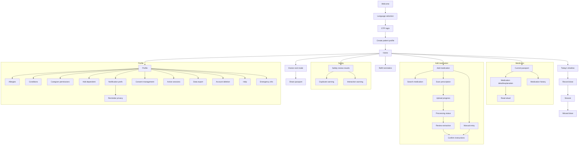

# 06 — Information Architecture

## Navigation model (patient PWA)

Bottom navigation, thumb-reachable, portrait-first, max 5 items:

| Tab | Icon + label | Contents |
|---|---|---|
| **Home** | house / "Home" | Due now, due next, missed, unresolved concerns, refill/completion reminders (priority order per spec §18) |
| **Medicines** | pill / "Medicines" | Current medication passport, previous/history, add medication entry points |
| **Add** (center FAB) | plus / "Add" | Search medication, manual entry, scan prescription, upload file, voice entry |
| **Concerns** | shield / "Safety" | Safety findings needing review, resolved history |
| **Profile** | person / "Profile" | Patient profile(s), allergies, conditions, caregivers, consent, sharing, preferences, sessions, help |

Caregiver accounts see a **profile switcher** (self + dependents) pinned above content; the active profile context is always visible.

## Site map

## The 20 core patient questions → where answered

| Question (spec §5) | Screen |
|---|---|
| 1 What am I currently taking? | Current medication passport |
| 2–3 Name / active ingredient | Medication detail |
| 4 Why prescribed (to me)? | Medication detail — "Your recorded reason" |
| 5 Common uses | Medication detail — "Commonly used for" (separate block) |
| 6–9 How much / when / food / how long | Medication detail + Today's timeline |
| 10–11 Side effects / warning signs | Medication explanation |
| 12 Same ingredient, multiple brands? | Duplicate ingredient warning + Safety review |
| 13 Interactions? | Interaction warning + Safety review |
| 14 Which doctor prescribed it? | Medication detail (prescriber) |
| 15 What to show a new doctor? | Doctor-visit mode |
| 16–17 Due now / missed | Home + Today's timeline |
| 18 Running out? | Refill reminder |
| 19 Concerns needing review? | Safety review results |
| 20 Who has caregiver access? | Caregiver permissions |

## Content hierarchy rules

- One primary action per screen; secondary actions demoted visually.
- Progressive disclosure on every clinical surface: **Explain simply → Tell me more → Show clinical details**, plus **Read aloud**.
- "Commonly used for" and "Your recorded prescription says it was prescribed for" are always separate, labeled blocks — never merged.
- Original captured values (OCR text, abbreviations) remain viewable behind "Show original" on confirmed records.
- Status banners (offline / syncing / sync failed / pending changes / last synced) render above tab content, never as toasts only.

## URL structure

Same origin for patient + caregiver (`app.example.com`), role-based experience. Locale-prefixed routes (`/te/...`). **No health information in URLs** — routes use opaque IDs (`/medicines/9f2c…`), never medication or patient names; query parameters never carry PHI (spec §12.5).

## Admin portal IA (`admin.example.com`)

Separate app, stronger auth: Catalog (products/brands/ingredients/combinations) · Content (education, translations, approvals — maker-checker) · Rules (safety rules, versions, review) · Incidents · Audit · Operations · Support.
