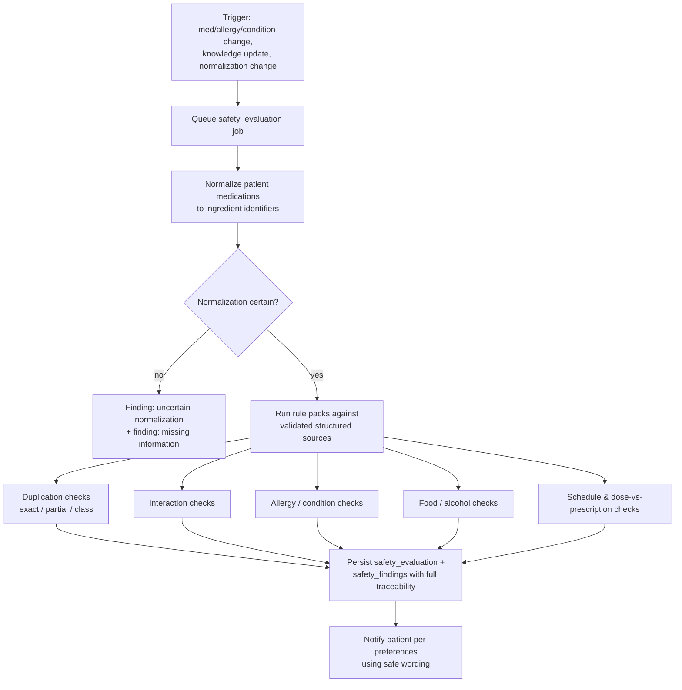

# 09 — Clinical Safety Strategy

Core architecture rule: **deterministic clinical rules are strictly separated from generative explanations** (spec §15). Validated structured data decides *whether* to warn; AI only rephrases, translates, and explains approved content ([19-ai-use-and-guardrails](19-ai-use-and-guardrails.md)).

## Deterministic clinical layer (authoritative, Railway-only)

Runs exclusively in the Railway API/worker (`packages/clinical-rules` executed server-side). **Never** in a browser, PWA service worker, native client, or Cloudflare Worker. Clients may display cached prior results, clearly timestamped; the Railway clinical service is authoritative.

Uses validated structured sources ([11-medication-knowledge-strategy](11-medication-knowledge-strategy.md)) for: medication normalization, ingredient duplication, therapeutic classes, interactions, allergy matching, contraindications, dose units, severity, evidence, missed-dose instructions, warning symptoms.

### Evaluation triggers (spec §14.5)

Safety review runs when: medication added · medication changes · medication restarts · allergy added · condition added · prescription imported · medication normalization changes · clinical knowledge changes · missing medication information is resolved.

### The 12 finding categories

1. Exact active-ingredient duplication
2. Partial ingredient duplication in a combination
3. Possible therapeutic-class duplication
4. Potential drug-drug interaction
5. Drug-allergy concern
6. Drug-condition concern
7. Food concern
8. Alcohol concern
9. Schedule conflict
10. Dose differs from confirmed prescription
11. Missing information
12. Uncertain normalization

### Mandatory finding contents

Every finding persists: medicines involved · concern type · severity · plain-language explanation · evidence source · rule version · evaluation time · input data · recommended next action · approved urgent symptoms where applicable · the instruction not to change medication independently.

### Traceability contract

Every result is traceable to: **source, source version, rule version, application version, evaluation time, input data, normalized medication identifiers, review status.** Persisted in `safety_evaluations` / `safety_findings` ([13-data-model](13-data-model.md)); immutable once written; re-evaluations create new rows rather than mutating history.

### Patient-facing wording (non-negotiable)

Every warning includes all four statements: possible concern phrasing ("Possible duplicate ingredient") · "This may have been prescribed intentionally" · "Please confirm with your doctor or pharmacist" · "Do not stop or change your medicine based only on this alert." When no reliable data exists: *"Reliable medication-safety information is not available for this medicine. Please confirm with a doctor or pharmacist."*

## Ambiguity handling (spec §6)

No ambiguous abbreviation (OD, BD, TDS, QID, SOS, HS, 1-0-1, 1-1-1, …) is ever silently interpreted. The system always: shows the detected abbreviation → shows the proposed plain-language interpretation → shows extraction/interpretation confidence → highlights uncertainty → requires confirmation → preserves the original value → preserves the confirmed value → records who confirmed and when → allows later correction. Extracted text is never treated as clinically confirmed (spec §14.2).

## Human-in-the-loop boundaries

- Tapers: never created or modified unless from a confirmed prescription or authorized professional (spec §14.4).
- Patient-specific reason: never inferred from common indications; the two are separate fields with separate provenance.
- Stop/start/dose-change: always attributed to prescriber decisions the patient records; the app never recommends them.
- Finding acknowledgement never deletes a finding; high-severity findings remain visible as acknowledged.

## Clinical governance

- All patient-facing clinical content (education, missed-dose guidance, warning symptoms, translations) passes **maker-checker approval** by clinically qualified reviewers before publication; versioned with review dates (`clinical_content_versions`, `content_approvals`).
- Safety rules are versioned (`safety_rule_versions`); rule changes trigger re-evaluation of affected patients (worker job, rate-controlled).
- Alert quality is monitored: false-positive rate, override/acknowledgement patterns, professional-review outcomes feed rule tuning ([21](21-observability-and-audit.md), [34](34-clinical-validation-plan.md)).
- Incidents involving clinical content or findings follow the incident runbook ([30](30-operational-runbooks.md)) and are recorded in the hazard log ([10](10-clinical-hazard-log.md)).

## Status categories in force

The safety engine ships in Stage 6 marked **Requires clinical validation** until [34-clinical-validation-plan](34-clinical-validation-plan.md) gates pass; sample catalog data is marked **Mocked** and is never presented as clinically reviewed.
