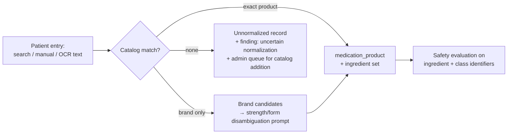

# 11 — Medication Knowledge Strategy

Goal: a medication knowledge base that actually covers **India** — brands, fixed-dose combinations (FDCs), manufacturers, strengths, forms, release types — with validated safety data and multilingual patient education. **Do not assume US medication data fully covers India** (spec §16): Indian FDCs, brand names, and availability differ substantially from RxNorm/US compendia coverage.

## Domain model requirements

First-class support for: Indian brand names · generic names · active-ingredient names · fixed-dose combinations · multiple manufacturers · strengths · dosage forms · release types (IR/SR/XR/CR) · routes · therapeutic classes · generic relationships · brand aliases (incl. transliterations) · look-alike names · sound-alike names · regulatory references · interactions · patient education · multilingual content. Schema: `medication_ingredients`, `medication_brands`, `medication_products`, `medication_product_ingredients`, `medication_strengths`, `dosage_forms`, `administration_routes`, `manufacturers`, `therapeutic_classes`, `product_classifications` ([13-data-model](13-data-model.md)).

Normalization target: every patient medication resolves to a **product** (brand + strength + form) and its **ingredient set**; safety rules operate on ingredient/class identifiers, never brand strings.

## Source evaluation (spec §16)

For every source we document: license · commercial-use permission · geographic coverage · completeness · update frequency · versioning · review process · limitations · replacement strategy. Tracked in `clinical_sources` and summarized here.

| Source | Role | License/commercial | India coverage | Limitations | Status |
|---|---|---|---|---|---|
| CDSCO published data (approved drugs, banned FDCs) | Regulatory reference, FDC legitimacy | Public | ✅ regulatory | Not a structured product catalog; irregular formats; needs curation | Evaluate — Stage 6 |
| RxNorm (NLM) | Terminology backbone for ingredients/classes; cross-mapping | Free incl. commercial (source-vocabulary restrictions apply — use RxNorm-native content only) | ⚠️ ingredients yes, Indian brands/FDCs largely absent | US-centric brand layer; many Indian FDC combinations missing | Evaluate — terminology support only |
| Licensed Indian medication database (e.g. commercial Indian drug DB vendors) | Authoritative Indian brand/product/price catalog | **Commercial license required — must be negotiated** | ✅ | Cost; licensing terms; update cadence to verify | **Open decision OD-3** ([24](24-open-decisions-and-assumptions.md)) |
| Validated interaction/contraindication provider (e.g. licensed compendium API) | Interactions, contraindications, severity, evidence | Commercial license required | ⚠️ ingredient-level generally applicable; FDC handling to verify | Cost; India-specific FDC gaps | **Open decision OD-4** |
| Clinically reviewed internal content | Patient education, missed-dose guidance, warning symptoms, translations | Owned | ✅ by construction | Authoring cost; needs clinical reviewers and maker-checker | Core plan — Stage 6+ |

**Rule:** interaction and contraindication data comes only from a validated licensed provider or clinically reviewed internal content — never scraped, never AI-generated ([19](19-ai-use-and-guardrails.md)). Until a provider is licensed, interaction checks stay dark and the UI shows the "no reliable information" fallback; duplicate-ingredient checks (which need only our own normalization) can ship earlier.

## Content lifecycle

1. **Catalog curation** (admin portal): products, brand→ingredient mappings, combinations — maker-checker approved, versioned, with regulatory references.
2. **Patient education content**: authored/localized internally, clinically reviewed, versioned (`clinical_content_versions`), carries source + review status + last-reviewed date, displayed with provenance on every medication card.
3. **Translations**: en master → hi/te/ur by qualified translators, clinical sign-off, versioned; AI may draft, humans approve ([19](19-ai-use-and-guardrails.md)).
4. **Updates**: provider updates land via worker jobs with version bumps; knowledge changes trigger targeted safety re-evaluation (spec §14.5); freshness checks via cron flag stale review dates.
5. **Deprecation**: source replacement strategy documented per source before adoption; normalized identifiers insulate patient records from source switches.

## Seed data policy (MVP)

Stage 2 ships a small, clearly-marked **sample catalog** (common Indian products: e.g. metformin, amlodipine, telmisartan brands and one FDC) for development and demo. Status: **Mocked / Requires clinical validation**. It is never presented as clinically reviewed content; production launch requires a licensed catalog (OD-3) and reviewed content.
