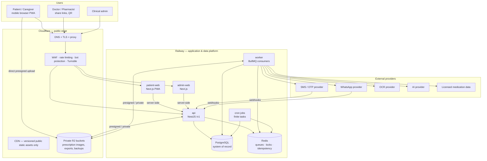

# 12 — System Architecture

## System context



Division of responsibility (spec §7): **Railway** runs every application, worker, cron, PostgreSQL, and Redis. **Cloudflare** is the public front door (DNS, TLS, WAF, rate limiting, Turnstile, CDN for public static assets) and private object storage (R2). Cloudflare is never a second application backend; no authoritative patient/clinical data in KV/D1/Durable Objects/Workers/edge caches; no Workers AI/Vectorize for clinical reasoning. Any Cloudflare compute capability requires an ADR (spec §7.2 conditions).

## PWA architecture

```mermaid
flowchart LR
    subgraph Browser
        UI[Next.js app shell\nReact, ui-web components]
        SW[Service worker (Serwist)\nprecache shell · runtime cache rules\noffline fallback · update flow]
        IDB[(IndexedDB\nmedication cache · schedule cache\nmutation queue · sync cursors)]
    end
    UI <--> SW
    UI <--> IDB
    SW -->|network first, no-store for PHI| API[Railway API]
    UI -->|api-client + offline-sync packages| API
```

- Shell + static assets precached, versioned, with update notification (screen: version update).
- **PHI responses are never cached by the service worker**; offline PHI lives only in IndexedDB under the sync contract ([15](15-offline-sync-strategy.md)).
- Capability detection everywhere ([32](32-browser-capability-and-fallback-matrix.md)); clinical evaluation never client-side.

## Runtime components

| Service | Tech | Public | Responsibilities (spec §11) |
|---|---|---|---|
| `api` | NestJS, Dockerfile, stateless, horizontally scalable | via Cloudflare | AuthN/Z, all patient/caregiver/medication/schedule/consent/sharing/admin APIs, upload & download authorization, offline sync, exports, deletion; graceful shutdown, timeouts, structured logs + correlation IDs, `/healthz` `/readyz`, protected metrics, idempotent sensitive writes, versioned `/v1` |
| `patient-web` | Next.js | via Cloudflare | Patient + caregiver PWA, app shell, localization, secure sessions; personalized SSR never publicly cached |
| `admin-web` | Next.js | via Cloudflare (+ optional Cloudflare Access) | Clinical/admin portal; stronger authentication |
| `worker` | Node + BullMQ | private | Notifications, OCR, extraction, normalization, safety evaluation, PDFs, exports, translation, AI explanation, webhooks, retries, cleanup, audit enrichment, knowledge updates. Jobs: idempotent, retry limits, exponential backoff, DLQ, correlation IDs, rule/source versions, manual replay, concurrency controls |
| `cron` | Node one-shot processes | private | Finite tasks only (due-reminder detection, refill generation, missed-dose reconciliation, link expiry, upload cleanup, freshness checks, backup exports + verification, retention cleanup, stuck-job reconciliation, reports, review nudges). Idempotent; never long-running consumers |
| PostgreSQL | Railway addon, private networking | never | Authoritative system of record ([25](25-railway-deployment-architecture.md) hardening) |
| Redis | Railway addon, private networking | never | Queues, locks, idempotency keys, rate coordination, short-lived cache/sessions, background state — **never sole store for any §7.1-listed entity** |

## Key data flows

- **Upload:** client → API (authorize) → presigned R2 PUT → client reports completion → API verifies object → queue OCR ([26](26-cloudflare-edge-and-r2-architecture.md) diagrams).
- **Safety evaluation:** trigger → queue → normalize → rule packs → persisted findings ([09](09-clinical-safety-strategy.md) diagram).
- **Reminders:** cron detects due → worker dispatch → channel providers → webhook status → acknowledgement ([16](16-reminder-and-notification-strategy.md) diagrams).
- **Offline sync:** IndexedDB queue → `/v1/sync` batches → conflict resolution ([15](15-offline-sync-strategy.md) diagram).

## Repository layout (Turborepo, spec §20)

```text
apps/       patient-web · admin-web · api · worker · cron · mobile-native (placeholder)
packages/   database (Prisma) · domain · api-client · validation · clinical-rules ·
            medication-terminology · authorization · consent · audit · notifications ·
            object-storage · observability · localization · design-tokens · ui-web ·
            offline-sync · config
infra/      railway/ · cloudflare/
docs/
```

Technology baseline: Turborepo, TypeScript (strict), Next.js, NestJS, PostgreSQL + Prisma, Redis, IndexedDB, React Native + Expo (later), Cloudflare R2/DNS/proxy/WAF/rate limiting/Turnstile, OpenAPI, FHIR mapping module, Docker, Railway, structured logs, metrics, traces, feature flags, audit framework.

## Cross-cutting invariants

1. PostgreSQL is the single system of record; Redis is coordination only; container filesystems hold nothing permanent.
2. Clients and edge never run authoritative clinical logic.
3. Every sensitive read/write emits an audit event (`packages/audit`).
4. No PHI in URLs, logs, analytics, object keys, cache keys, or error breadcrumbs; opaque identifiers everywhere (spec §12.5).
5. All environments (dev/staging/prod) fully isolated — services, DBs, buckets, secrets ([28](28-environment-and-secrets-strategy.md)); no production data outside production.
