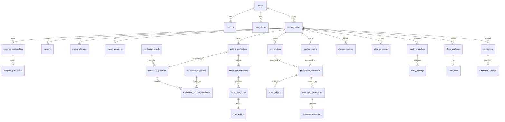

# 13 — Data Model (PostgreSQL)

Authoritative schema lives in `packages/database/prisma/schema.prisma`. This document specifies purpose, keys, constraints, enums, retention, R2 relationships, and offline behavior per entity (spec §22). Stage 2 implements the subset marked ★; remaining tables are defined here and land with their stage.

## Global conventions (apply to every table unless overridden)

- **Primary keys:** `id uuid` (v7, time-ordered), generated server-side. All exposed identifiers are opaque UUIDs — never sequential, never containing PHI.
- **Timestamps:** `created_at`, `updated_at` (`timestamptz`, UTC). Clinical/audit rows additionally record event-time fields explicitly.
- **Soft delete:** patient-owned records use `deleted_at timestamptz NULL` + partial indexes `WHERE deleted_at IS NULL`; hard delete only via retention/deletion processing. Catalog/config tables use `status` enums instead. Audit tables are append-only, never deleted except by retention policy.
- **Audit approach:** every mutation of PHI-bearing tables emits an `audit_events` row (actor, action, entity, before/after digests — not raw PHI values) via `packages/audit` in the same transaction.
- **Versioning:** clinical content, rules, and catalog mappings are copy-on-write (`*_versions` tables); patient records keep `row_version int` for optimistic concurrency (spec §23).
- **Ownership & access:** patient-owned rows carry `patient_profile_id`; access is evaluated per active profile through `packages/authorization` (owner, caregiver scope, or admin duty). Original vs normalized/confirmed values are **always separate columns** — originals immutable.
- **Retention:** defaults per class — identity/clinical records: life of account + regulated retention window; operational logs: 90 days; audit: ≥ 7 years (configurable, OD-7); temporary artifacts: hours–days via lifecycle jobs.
- **Offline sync:** only tables marked *sync: yes* participate in the PWA contract ([15](15-offline-sync-strategy.md)); all others are online-only.
- **R2:** no table stores permanent public R2 URLs; only opaque object keys via `stored_objects`.

## Entity-relationship overview

---

## Identity & access

### ★ users
Account = person who can sign in. Columns: `phone_e164 text UNIQUE NOT NULL` (encrypted at application level, deterministic-searchable), `phone_verified_at`, `email` (nullable, admins), `preferred_locale`, `status` enum `active|suspended|deletion_pending|deleted`. Indexes: unique phone. Retention: anonymized on deletion after grace. Sync: no.

### ★ user_devices
Known devices/browsers for session context and push targets. Columns: `user_id FK`, `kind` enum `browser|android|ios`, `user_agent_digest`, `push_endpoint` (encrypted, nullable), `last_seen_at`, `revoked_at`. Index `(user_id, last_seen_at)`. Sync: no.

### browser_installations
PWA install tracking (A2HS analytics + push scoping). `user_device_id FK`, `display_mode`, `installed_at`, `uninstalled_at`. Sync: no.

### ★ sessions
Server-side sessions. `user_id FK`, `token_hash text UNIQUE` (SHA-256 of opaque token; raw token never stored), `refresh_token_hash UNIQUE`, `user_device_id FK`, `expires_at`, `refresh_expires_at`, `revoked_at`, `revoke_reason`. Indexes: token hashes, `(user_id, revoked_at)`. Retention: 30 days past expiry then purged. Sync: no — but revocation propagates to clients ([15](15-offline-sync-strategy.md)).

### ★ otp_attempts
OTP lifecycle + abuse control. `phone_e164_digest` (HMAC — raw phone not stored here), `otp_hash` (argon2id; **never plaintext**), `purpose` enum `login|recovery|share_verification`, `expires_at`, `consumed_at`, `verify_attempts int`, `sent_count int`, `last_sent_at`, `ip_digest`, `turnstile_verified bool`. Indexes: `(phone_e164_digest, created_at)`. Constraints: attempt/resend limits enforced in logic + `verify_attempts <= 5` check. Retention: 30 days. Sync: no.

## Profiles, caregivers, consent

### ★ patient_profiles
A person whose medications are managed (self or dependent). `owner_user_id FK` (account that created it), `claimed_by_user_id FK NULL` (dependent who claimed it), `display_name`, `year_of_birth smallint`, `sex` enum nullable, `preferred_locale`, `emergency_card jsonb NULL` (opt-in), `deleted_at`. Index `(owner_user_id)`. Ownership: the patient (claimed user) outranks the creating caregiver. Sync: yes (own/authorized profiles).

### ★ caregiver_relationships
`patient_profile_id FK`, `caregiver_user_id FK`, `relationship` enum, `status` enum `invited|active|revoked|expired`, `invited_phone_digest`, `accepted_at`, `expires_at NULL`, `revoked_at`, `revoked_by`. Unique `(patient_profile_id, caregiver_user_id)` where active. Audit: every state change + every use. Sync: no (server-enforced each request).

### ★ caregiver_permissions
Granular scopes per relationship. `caregiver_relationship_id FK`, `scope` enum `view_medications|view_schedule|manage_reminders|record_doses|add_medications|edit_medications|review_concerns|share_records|manage_profile|full_management`, `granted_at`, `granted_by`, `revoked_at`. Unique `(relationship, scope)` active. Sync: no.

### ★ consents
`patient_profile_id FK`, `type` enum `data_processing|sms_reminders|whatsapp_reminders|email|caregiver_access|sharing|ai_processing|emergency_card`, `purpose text`, `scope jsonb`, `status` enum `active|revoked|expired`, `granted_at`, `expires_at NULL`, `revoked_at`. Purpose-bound, revocable, time-bound. Sync: read-only cache.

### ★ consent_events
Append-only consent history: `consent_id FK`, `event` enum `granted|renewed|revoked|expired|enforced`, `actor_user_id`, `context jsonb`, `occurred_at`. Retention: audit-class. Sync: no.

### ★ practitioners / organizations
Prescriber and clinic/hospital directory (patient-entered in MVP). `display_name`, `speciality`/`kind`, `phone NULL`, `created_by_profile_id` (patient-scoped entries in MVP; global verified directory later), `deleted_at`. Resolved by case-insensitive trimmed name within a profile, so the same doctor typed on two medicines (or on a prescription record) is one row — a per-doctor view depends on this. An empty/whitespace-only prescriber name means "no prescriber" and clears the link rather than creating an unnamed record. Sync: yes (referenced by medications). `organizations` is **not implemented** — `phone` isn't either.

### ★ patient_conditions / ★ patient_allergies
`patient_profile_id FK`, `label text` (patient-reported) + `condition_code`/`allergen_ingredient_id FK NULL` (normalized), `severity` enum for allergies, `reaction_note`, `source` enum `patient|document|professional`, `status` enum `active|inactive`, `recorded_by`, `deleted_at`. Changes trigger safety re-evaluation. Sync: yes.

## Medication catalog (non-PHI, admin-owned)

### ★ medication_ingredients
Active ingredients. `name text UNIQUE`, `rxnorm_ingredient_id NULL`, `synonyms text[]`, `status` enum `active|deprecated`. Index: trigram on name+synonyms for search.

### ★ therapeutic_classes / product_classifications
Class taxonomy (`name`, `parent_id`, `system`) and product↔class join with `source`+version.

### ★ manufacturers / ★ dosage_forms / ★ administration_routes
Reference lists: `name UNIQUE`, `status`. Forms carry `release_type` enum `immediate|sustained|extended|controlled|unspecified` at product level.

### ★ medication_brands
Indian brand names. `name`, `manufacturer_id FK`, `aliases text[]` (incl. transliterations), `status`. Trigram index on name+aliases.

### ★ medication_products
Sellable product = brand + form + strength set. `brand_id FK NULL` (null = generic product), `generic_name`, `dosage_form_id FK`, `route_id FK`, `release_type`, `is_combination bool`, `regulatory_ref text NULL`, `source_id FK`, `source_version`, `status` enum `active|deprecated|banned`. Versioned via catalog change records; maker-checker approved.

### ★ medication_product_ingredients
Combination decomposition: `product_id FK`, `ingredient_id FK`, `strength_value numeric`, `strength_unit` enum, unique `(product_id, ingredient_id)`.

### ★ medication_strengths
Enumerated strength presentations per product where multiple exist. `product_id FK`, `label`, `per_unit jsonb`.

Retention: catalog is permanent, append/deprecate only. Access: read by all authenticated users; write via admin maker-checker. Sync: yes (read-only reference cache subset).

## Prescriptions & documents

### ★ prescriptions
A prescribing event — one doctor visit's prescription. `patient_profile_id FK`, `practitioner_id FK NULL`, `prescribed_at date NULL`, `notes text NULL`, `deleted_at`. Every field but the profile is optional: a patient who can't read the doctor's handwriting should still be able to file the photo. Soft-delete never cascades — attached documents and linked medications keep their `prescription_id`, and reads simply stop surfacing the deleted parent (matching every other soft-deleted parent in this codebase). Sync: no — online-only, matching the glucose/checkup precedent for simple patient-owned records.

**Trimmed from the original spec above, deliberately:** `organization_id` (no `organizations` table exists yet — nothing to reference), and `source`/`status` enums. This pass has exactly one creation path — a patient or caregiver filling in a form — so both would be permanently stuck at a single constant value. Reintroduce them if an automated creation path (e.g. OCR-driven multi-drug prescription detection) is ever built.

### ★ prescription_documents
Uploaded evidence. **Genuinely multi-owner despite the name** — it now holds prescription images, one-off medicine scans, *and* test-report files. The name and table name are historical; renaming a live table holding real pilot patient data was judged riskier than the clarity was worth. `prescription_id FK NULL` (set when the upload belongs to a prescription record), `report_id FK NULL` (set when it belongs to a `medical_reports` record), both null for a one-off scan-to-add-a-medicine upload which needs no standing record of its own; at most one is ever set. `patient_profile_id FK`, `stored_object_id FK`, `kind` enum `prescription|strip|box|bottle|discharge_summary|lab_report|scan_report|other`, `status` enum `pending_upload|uploaded|verified|quarantined|processing|processed|failed|deleted`. R2: 1:1 with stored object. Retention: original preserved while medication references it; lifecycle rules otherwise. Sync: metadata only, never binaries. (`page_no` from the original spec is not implemented — multi-page documents are filed as separate rows against the same prescription.)

### ★ medical_reports
A test result the patient keeps a copy of — blood/urine panels, imaging, ECGs, pathology, discharge summaries (docs/07 screen 44). `patient_profile_id FK`, `kind` enum `blood_test|urine_test|imaging|ecg|pathology|discharge_summary|other` (the only required field), `label text NULL` (free text — "Vitamin D panel"), `facility_name text NULL`, `practitioner_id FK NULL` (the ordering doctor, sharing the deduplicated `practitioners` pool with prescriptions and medications), `tested_at date NULL` (sample/scan date), `notes text NULL`, `deleted_at`. Documents attach via `prescription_documents.report_id`. Soft-delete never cascades. Sync: no — online-only, matching the prescriptions/glucose/checkup precedent.

**Document-first: per-analyte values are deliberately not stored.** There is no `report_values` table and no open-domain clinical value store anywhere in this schema — every clinical number here is a fixed, named column (`fasting_glucose_mg_dl`, `value_mg_dl`) with its unit baked into the name. Storing arbitrary analytes would be the first open-domain clinical store in the model, would need its own units/reference-range/LOINC normalization to be worth anything, and would ask a patient to type twenty rows off a lab printout on a phone. The uploaded document is the record; notes carry what the doctor said. This can be layered on later without reworking what's here.

**Overlaps `checkup_records` on four analytes and is never auto-synced with it.** See docs/07 screens 42/44: check-ups are the manual-transcription surface, reports are the document archive.

### stored_objects
Every R2 object. `bucket` enum, `object_key text UNIQUE` (opaque, no PHI), `sha256`, `size_bytes`, `content_type`, `status` enum `pending|verified|quarantined|deleted`, `expires_at NULL`. Constraint: object_key generated server-side. R2 relationship: authoritative record; deletion coordinates DB + R2 ([26](26-cloudflare-edge-and-r2-architecture.md)).

### object_access_events
Append-only access audit for objects: `stored_object_id FK`, `actor`, `operation` enum `presign_upload|presign_download|stream|delete`, `context jsonb`, `occurred_at`. Retention: audit-class.

### prescription_extractions
One OCR run. `prescription_document_id FK`, `engine`, `engine_version`, `status` enum `queued|running|succeeded|failed`, `raw_output_object_id FK NULL` (temporary R2), `completed_at`. Versioned by run; originals never overwritten.

### extraction_candidates
Per-field proposals. `extraction_id FK`, `field` enum (`brand`,`ingredient`,`strength`,`frequency_code`,`timing`,`food_instruction`,`duration`,…), `detected_text` (original, immutable), `proposed_interpretation`, `confidence numeric(4,3)`, `status` enum `proposed|confirmed|corrected|rejected`, `confirmed_value NULL`, `confirmed_by FK NULL`, `confirmed_at NULL`. Constraint: `status='confirmed' ⇒ confirmed_by/at NOT NULL`. The §6 protocol lives here.

## Patient medications & scheduling

### ★ patient_medications
The passport core. `patient_profile_id FK`, `product_id FK NULL` (normalized), `entered_name text` (original, immutable), `normalization_status` enum `unmatched|candidate|confirmed`, `patient_reason text NULL` (**patient-specific reason — never inferred**), `prescription_id FK NULL` (optional evidence — a medicine with no prescription on file is a normal, fully-valid entry, never flagged as incomplete), `practitioner_id FK NULL`, `source` enum `search|manual|extraction|previous|import`, `status` enum `current|paused|completed|stopped|unknown`, `status_changed_at`, `status_reason`, `start_date`, `end_date NULL`, `is_prn bool`, `quantity_on_hand numeric NULL`, `row_version int`, `deleted_at`. Indexes: `(patient_profile_id, status) WHERE deleted_at IS NULL`, `(prescription_id)`. Sync: yes — key offline entity.

### ★ medication_instructions
Structured dosing per medication (typed, from confirmed input). `patient_medication_id FK`, `dose_quantity numeric`, `dose_unit`, `frequency_code` enum `OD|BD|TDS|QID|SOS|HS|pattern|alternate_day|weekly|fortnightly|monthly|custom` (`fortnightly`/`monthly` added Stage 4 follow-up — see below), `pattern text NULL` (e.g. `1-0-1`), `food_instruction` enum `before|with|after|any|bedtime`, `timing_slots jsonb`, `duration_days int NULL`, `original_text NULL` (immutable), `confirmed_by`, `confirmed_at`, `row_version`. Sync: yes.

### medication_schedules
Executable schedule derived from instructions. `patient_medication_id FK`, `timezone`, `slot_times jsonb`, `recurrence` enum `daily|weekly|fortnightly|monthly` (`alternate`/`taper`/`custom` remain deferred — see below), `anchor_date date NULL` (**built, Stage 4 follow-up**: reference date for weekly/fortnightly/monthly — day-of-week or day-of-month comes from it, month-end clamped; null for daily), `active_from`, `active_to`, `status` enum `active|paused|ended`. Sync: yes.

**Built and live (Stage 4 follow-up, this session):** `WEEKLY` — previously a schema-level placeholder with no UI option and no schedule derivation at all — is now real, alongside two newly added codes, `FORTNIGHTLY` ("once in 2 weeks") and `MONTHLY` ("once a month"), both requested by the user as common real-world dosing patterns (weekly/monthly injectables, methotrexate, bisphosphonates, etc.) that had no provision before. All three anchor to the medication's own `start_date` (editable via `PATCH /v1/medications/:id`) — weekly/fortnightly match every 7th/14th day from it, monthly matches the same day-of-month, clamped to the last day of shorter months (e.g. a 31st anchor recurs on the 28th/29th in February). `alternate_day`/`CUSTOM`/`QID` remain unschedulable placeholders — still need a per-dose-date or per-profile picker not built yet (docs/09 §6).

### scheduled_doses
Materialized due doses (rolling window generated by cron). `medication_schedule_id FK`, `due_at timestamptz`, `slot_label`, `status` enum `upcoming|due|taken|skipped|missed|snoozed|could_not_take|unavailable|problem|taken_other_time|cancelled`, unique `(schedule_id, due_at)`. Retention: 24 months then aggregated. Sync: yes (window).

### dose_events
Append-only record of what actually happened. `scheduled_dose_id FK NULL` (PRN doses have none), `patient_medication_id FK`, `action` enum (as above), `recorded_by_user_id`, `recorded_at`, `effective_at`, `client_mutation_id uuid UNIQUE NULL` (**offline idempotency**), `channel` enum `pwa|caregiver|native|api`. Sync: yes — offline-writable.

### medication_changes
Append-only change log per medication (who/what/when/why) powering history + doctor-visit "recent changes". Sync: read cache.

### medication_reconciliations
Discharge/multi-doctor reconciliation sessions: `patient_profile_id`, `source_document_id NULL`, `status`, `decisions jsonb` (continued/changed/stopped, each attributed). Sync: no.

## Patient-recorded clinical measurements

### ★ glucose_readings
One blood-sugar reading from the paper diary (docs/07 screen 42). `patient_profile_id FK`, `measured_at timestamptz`, `context` enum `before_breakfast|after_breakfast|before_lunch|after_lunch|before_dinner|after_dinner|during_night|random`, `value_mg_dl int`, `note text NULL`, `deleted_at`. mg/dL only — the unit is in the column name, matching how every other clinical number in this model is stored. Sync: no — online-only.

### ★ checkup_records
One periodic check-up's measurements (docs/07 screen 42, second tab). `patient_profile_id FK`, `checkup_date date` (the only required field), then every metric nullable and **never zero-filled**: `fasting_glucose_mg_dl`, `post_prandial_glucose_mg_dl`, `hba1c_percent numeric`, `blood_pressure_systolic`, `blood_pressure_diastolic`, `weight_kg numeric`, `waist_circumference_cm numeric`, `cholesterol_mg_dl`, `treatment_changes text NULL`, `next_appointment_date NULL`, `deleted_at`. A metric the doctor didn't record stays NULL and is omitted everywhere it's rendered — a fabricated-looking zero on a clinical summary is worse than a gap. Sync: no — online-only.

## Safety

### safety_rules / safety_rule_versions
Rule registry: `key UNIQUE`, `category` (1–12), `severity_default`, `status` enum `draft|active|retired`. Versions: `rule_id FK`, `version`, `logic jsonb`, `source_id FK`, `source_version`, `approved_by`, `approved_at` — immutable.

### safety_evaluations
One evaluation run. `patient_profile_id FK`, `trigger` enum, `input_snapshot jsonb` (normalized inputs), `app_version`, `started_at`, `completed_at`, `status`. Immutable.

### safety_findings
`evaluation_id FK`, `category` (1–12), `severity` enum `info|low|moderate|high`, `medications uuid[]`, `explanation_key` + rendered `explanation text`, `evidence_source_id FK`, `source_version`, `rule_version_id FK`, `recommended_action_key`, `status` enum `open|acknowledged|reviewed_with_professional|resolved|superseded`, `resolved_by`, `resolved_at`. Full traceability contract ([09](09-clinical-safety-strategy.md)). Sync: read cache.

### safety_finding_actions
Append-only actions on findings (`acknowledged`, `note_added`, `reviewed`, `escalated`) with actor + timestamp.

## Clinical content

### clinical_sources
Source register: `name`, `license`, `commercial_use bool`, `coverage`, `update_frequency`, `limitations`, `replacement_strategy`, `status`.

### clinical_content / clinical_content_versions / translations / content_approvals
Content: `kind` enum `education|missed_dose|warning_symptoms|food_alcohol|storage`, `product_id|ingredient_id`, current `version_id`. Versions immutable: `body jsonb`, `locale='en'`, `source_id`, `review_status` enum `draft|in_review|approved|retired`, `reviewed_by`, `last_reviewed_at`. Translations: `version_id FK`, `locale`, `body`, `status` (approved only shown), translator + clinical approver. Approvals: maker-checker records (`maker`, `checker`, `decision`, `decided_at`; maker ≠ checker constraint).

## Sharing

### share_packages
What was shared: `patient_profile_id`, `sections jsonb` (selective sharing), `snapshot_object_id NULL` (generated PDF in R2), `consent_id FK`, `created_by`. 

### share_links
`share_package_id FK`, `token_hash UNIQUE`, `kind` enum `link|qr|pdf|whatsapp_text`, `expires_at NOT NULL`, `max_accesses int NULL`, `one_time_verification` enum `none|otp`, `revoked_at`, `revoked_by`. Constraint: expiry mandatory.

### share_access_events
Append-only: `share_link_id`, `accessed_at`, `ip_digest`, `verification_result`, `sections_viewed`. Visible to the patient. Retention: audit-class.

## Notifications

### notifications
Logical notification: `patient_profile_id`, `kind` enum `dose_reminder|refill|completion|missed_dose|safety_finding|caregiver_escalation|system`, `scheduled_dose_id NULL`, `privacy_mode` enum `generic|standard|full_name|custom`, `dedupe_key UNIQUE`, `status` enum `pending|dispatching|done|cancelled`.

### notification_channels
Per-user channel registrations: `user_id`, `channel` enum `in_app|web_push|sms|whatsapp|email|caregiver`, `address` (encrypted), `consent_id FK NULL` (**required for sms/whatsapp/email/caregiver**), `status` enum `active|paused|failed|revoked`.

### notification_attempts
Delivery truth table: `notification_id FK`, `channel`, `status` enum `queued|sent|delivered|failed|retried|acknowledged|snoozed|ignored|escalated`, `provider_message_id`, `provider_status jsonb`, `attempted_at`, `status_at`. Never assume delivery ([16](16-reminder-and-notification-strategy.md)). Retention: 12 months.

### notification_preferences
Per-profile: quiet hours, channel priorities, reminder privacy wording, escalation rules.

## Platform

### background_jobs / dead_letter_jobs
Job execution records mirroring BullMQ for auditability: `queue`, `job_key` (idempotency), `correlation_id`, `patient_profile_id NULL`, `rule_version NULL`, `attempts`, `status`, `error_digest`, `completed_at`. DLQ rows carry full failure context + `replayed_at`.

### ★ offline_mutations
Server-side ledger of applied client mutations: `client_mutation_id uuid UNIQUE`, `user_id`, `patient_profile_id`, `entity`, `operation`, `applied_at`, `conflict_resolution` enum NULL. Guarantees idempotency across retries. Retention: 90 days.

### sync_cursors
Per device+profile sync position: `user_device_id`, `patient_profile_id`, `cursor` (monotonic change sequence), `last_synced_at`.

### ★ audit_events
Append-only, hash-chained (`prev_hash`, `row_hash`): `actor_user_id NULL`, `actor_type` enum `patient|caregiver|admin|system|share_visitor`, `action text` (dot-namespaced), `entity_type`, `entity_id`, `patient_profile_id NULL`, `correlation_id`, `context jsonb` (digests, never raw PHI), `occurred_at`. Indexes: `(patient_profile_id, occurred_at)`, `(entity_type, entity_id)`. Retention ≥ 7 years. Access: patient sees own; admins via audited admin API.

### ai_explanations / ai_model_executions
Explanations cache: `content_version_id`/`finding_id`, `locale`, `level` enum `simple|more|clinical`, `body`, `execution_id FK`, `status` enum `generated|approved|rejected`. Executions: `provider`, `model_version`, `purpose`, `prompt_digest`, `output_digest`, `input_redaction_applied bool`, `consent_basis`, `latency_ms`, `occurred_at` — prompts/outputs stored out-of-log, digests only in ordinary telemetry ([19](19-ai-use-and-guardrails.md)).

### data_export_requests / deletion_requests / retention_actions
Exports: `patient_profile_id`, `status` enum `requested|generating|ready|downloaded|expired|failed`, `artifact_object_id NULL`, `expires_at`. Deletions: `status` enum `requested|grace|executing|completed|cancelled`, `grace_ends_at`, coordination checklist jsonb (PG, R2, shares, backups-note, caregivers-notified). Retention actions: append-only record of every automated purge (policy, entity, count, executed_at).

### backup_executions / restore_tests
Backups: `kind` enum `pg_snapshot|pg_export_r2`, `status`, `location`, `size`, `checksum`, `completed_at`. Restore tests: `backup_execution_id FK`, `status` enum `passed|failed`, `verified_by`, `notes`, `tested_at` — **a backup without a passing restore test is not considered valid** ([27](27-backup-and-disaster-recovery.md)).

---

## Stage 2 implementation subset (★)

`users`, `user_devices`, `sessions`, `otp_attempts`, `patient_profiles`, `caregiver_relationships`, `caregiver_permissions`, `consents`, `consent_events`, `patient_conditions`, `patient_allergies`, catalog tables, `patient_medications`, `medication_instructions`, `medication_changes` (as change log), `offline_mutations` (idempotency for writes), `audit_events`. Practitioners/organizations ship as patient-scoped simple records.
