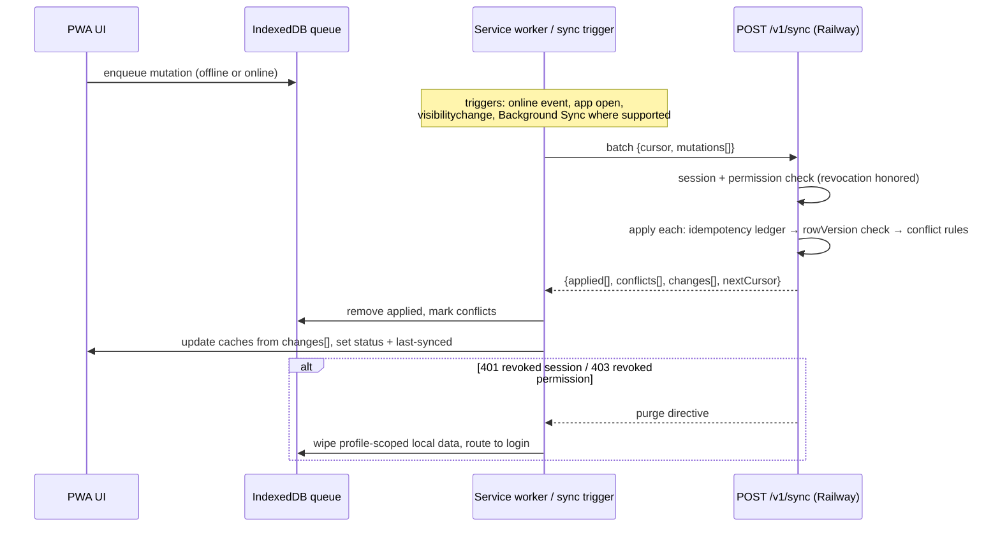

# 15 — Offline Sync Strategy

Goal (spec §19): view confirmed medications and today's schedule offline, record dose events offline, queue/retry changes, detect and reconcile conflicts — with honest status at all times: **Online / Offline / Synchronizing / Synchronization failed / Changes pending / Last synchronized time**.

## Storage layout (IndexedDB, `packages/offline-sync`)

| Store | Contents | Notes |
|---|---|---|
| `meta` | schema version, active profile, sync cursors, session digest | drives upgrades + revocation checks |
| `medications` | confirmed patient medications + instructions (read cache) | per profile |
| `schedule` | scheduled doses, rolling ±7 days | per profile |
| `catalog` | minimal product/ingredient reference for offline rendering | non-PHI |
| `content` | approved explanation content for cached meds, with content version | provenance shown offline |
| `mutations` | outbound queue (see contract) | FIFO with per-entity ordering |
| `findings` | cached safety findings (read-only, timestamped "as of") | server remains authoritative |

**Never stored client-side** (spec §19): R2 credentials, database credentials, provider secrets, long-lived unrestricted tokens, unencrypted prescription files, full sensitive audit history, clinical administration data. Web Crypto-based encryption-at-rest applied where practical; IndexedDB additionally protected by best-effort obfuscation + short-lived session binding (browser storage is not hardware-secure — documented limitation; native phases get encrypted storage).

## Mutation contract

```json
{
  "clientMutationId": "uuid-v7",
  "entity": "dose_event | patient_medication | medication_instruction | patient_profile | allergy | condition",
  "operation": "create | update | status_change | soft_delete",
  "payload": { "...": "typed per entity (packages/validation schemas)" },
  "baseRowVersion": 4,
  "capturedAt": "2026-07-16T08:01:00+05:30",
  "profileId": "…"
}
```

Rules: `clientMutationId` generated at capture; retries reuse it; server ledger (`offline_mutations`) makes application **exactly-once**; mutations for one entity apply in capture order; queue survives app restarts; failed items are visible and individually retryable/discardable (with confirmation) — never silently dropped.

## Sync flow



Background Sync API used where available; otherwise retry on reopen/online/visibility (mandated fallback, [32](32-browser-capability-and-fallback-matrix.md)). Exponential backoff with jitter; batch ≤ 50 mutations.

## Conflict rules (spec §19)

| Case | Resolution |
|---|---|
| Medication edit vs server edit | Field-level merge where disjoint; else server wins, client change surfaced as "needs your review" with both values (patient re-applies if wanted). Clinical-safety-relevant fields (dose, frequency) always require explicit re-confirmation on conflict. |
| Schedule edit conflict | Server wins; local change re-proposed to user. Never auto-merge times. |
| Patient profile edit | Last-writer-wins per field with audit of both. |
| Caregiver + patient edit same record | Same as medication edits; audit attributes both actors; patient's confirmation outranks caregiver's on clinical fields. |
| Dose-event duplication (same scheduledDose, overlapping actions) | `clientMutationId` dedupes exact retries; two genuinely different events for one scheduled dose → both kept, latest `effective_at` wins for status, both visible in history. |
| Offline edit of a record deleted server-side | Rejected with `deleted` conflict; user offered re-create. |
| Revoked permission during offline period | All queued mutations for that profile rejected 403; local profile data purged; user informed plainly. |
| Medication-state change conflicts (e.g. offline "taken" for a med stopped server-side) | Dose event recorded against historical medication (facts are facts); UI explains the med was stopped. |
| Prescription confirmation conflict (two confirmers) | First confirmation wins; second becomes a correction event with attribution. |

## Lifecycle management

- **App/schema upgrades:** service-worker update flow surfaces "new version available"; IndexedDB migrations run versioned, with fallback to full re-sync from server on migration failure (server is always the source of truth).
- **Cache invalidation:** server `changes[]` stream keyed by cursor; content-version bumps invalidate `content`; catalog TTL 7 days.
- **Storage pressure:** `navigator.storage.estimate()` monitored; low-storage mode trims to today's schedule + current meds; eviction detected → re-sync with notice.
- **Logout / session revocation:** profile-scoped stores wiped (where practical — documented browser limits); next open on a revoked session hits the purge directive path.
- **Private browsing / no IndexedDB:** clear online-only behavior; dose recording works while connected; no silent loss.

## Honest status UI

Status chip + screen 36 show the six states; "pending changes" shows human counts ("2 doses waiting to sync"); failures list per-item reasons with retry/discard. Sync telemetry (success rate, mutation success, conflict rate) feeds the §27 metrics via PHI-free events.
