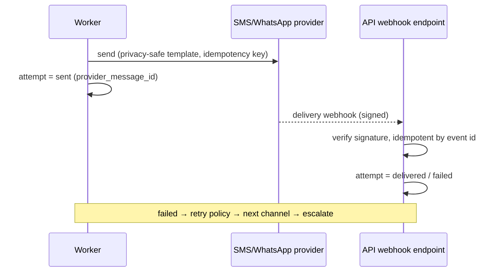

# 16 — Reminder and Notification Strategy

Reminders are a core product function. **Never depend only on browser notifications** (spec §10). The Railway backend is the source of truth for medication schedules, reminder due times, delivery status, attempts, dose acknowledgements, missed-dose status, and caregiver escalations. A reminder is never assumed delivered because a job was scheduled.

## Layered channels (priority order)

1. In-application reminders (always available)
2. Browser/PWA push where supported
3. SMS — **explicit consent required**
4. WhatsApp — **explicit consent + provider-policy compliance**
5. Email where useful
6. Caregiver reminders where authorized (consented escalation)
7. Native Android push (Phase 2) · 8. Native iOS push (Phase 3)

Channel selection per profile from `notification_preferences` + `notification_channels` (each non-in-app channel bound to a consent record), constrained by capability detection ([32](32-browser-capability-and-fallback-matrix.md)).

## Processing pipeline

```mermaid
flowchart LR
    CRON[Cron: detect due reminders\n(idempotent, windowed)] --> N[Create notifications\n(dedupe_key unique)]
    N --> Q[BullMQ reminder queue]
    Q --> W[Worker: resolve channels\nby preference + consent + capability]
    W --> A1[Attempt: web push]
    W --> A2[Attempt: SMS provider]
    W --> A3[Attempt: WhatsApp provider]
    W --> A4[In-app + badge]
    A1 & A2 & A3 --> S[notification_attempts:\nqueued → sent → delivered? / failed → retried]
    PROV[Provider webhooks\n(signature-verified)] --> S
    S --> ACK[Patient action:\nacknowledged / snoozed / ignored]
    ACK --> ESC{Unacknowledged\n+ escalation consented?}
    ESC -- yes --> CG[Caregiver notification]
    S --> REC[Cron: missed-dose reconciliation]
```

### Browser notification fallback

```mermaid
flowchart TD
    D{Push supported\n+ permission granted?} -- yes --> P[Web push attempt]
    P --> DL{Delivery confirmed\nor ack received?}
    D -- no --> F[Offer SMS / WhatsApp opt-in\n(consent flow) + in-app reminders]
    DL -- "no, within window" --> R[Retry then fall through\nto next consented channel]
    DL -- yes --> OK[Done]
    R --> F
```

### SMS / WhatsApp flow



## State machine (tracked per attempt)

`queued → sent → delivered (where provider data exists) → acknowledged | snoozed | ignored`; failure edges: `failed → retried` (capped, exponential backoff) and terminal `escalated` (caregiver). All §10 states tracked: Queued, Sent, Delivered, Failed, Retried, Acknowledged, Snoozed, Ignored, Escalated. Dose acknowledgement from any surface (timeline, notification action, caregiver) resolves the reminder everywhere.

## Privacy (spec §10)

Default wording never exposes medication names in SMS or lock-screen notifications. Options (screen 33): "Medicine reminder" (default) · "Time to take your scheduled medicine" · full medication name (**explicit opt-in**) · custom privacy-safe wording. Notification payloads carry opaque IDs; content is fetched after tap where the platform allows. SMS templates are pre-approved, localized, and PHI-free unless opted in.

## Making a reminder obvious (sound, vibration, persistence)

Patient-facing kinds (`dose_reminder`, `refill`, `completion`, plus the currently-unused `missed_dose`/`safety_finding`) get a louder push than a caregiver's own notifications: `requireInteraction: true` (persists on desktop instead of auto-dismissing after a few seconds), `tag`/`renotify` (a re-attempted send re-alerts rather than silently replacing), a vibration pattern, and `urgency: "high"` delivery (a hint to the OS to wake the device promptly rather than batch it). `caregiver_escalation`/`dose_correction` are deliberately untouched — they're caregiver-only and already bypass quiet hours on their own terms.

Two new per-profile toggles (screen 33, `NotificationPreference.soundEnabled`/`vibrationEnabled`, both default on) let the patient turn either off independently — `soundEnabled: false` sends `silent: true` instead of omitting the field, and `vibrationEnabled: false` omits the `vibrate` key entirely rather than sending an empty pattern.

A genuinely new in-app chime (Web Audio API, synthesized — no audio asset, no licensing question) plays on the Home screen the instant a push arrives **while the tab is already open**, via a new service-worker→client `postMessage` (there was no such channel before this) that also reuses the existing sync-engine `REMOTE_CHANGE_EVENT` mechanism to refresh the due-now/missed lists immediately — no polling added, no changes to `useTimeline()` itself. Real, unavoidable constraint: audio (any of it, including this) can only play in a tab that has recorded at least one user gesture since load — a completely untouched tab may not chime on the very first attempt. The OS push notification above remains the reliable channel regardless; the chime is a bonus, not a replacement, matching this doc's own opening line.

## Scheduling correctness

- Due times computed server-side from `medication_schedules` in the profile's timezone; device timezone changes update the schedule explicitly (travel prompt, [spec §14.4]).
- Cron runs every minute over a sliding window with an idempotent `dedupe_key` (`profile:scheduledDose:channelWindow`) — restarts/replays cannot double-send.
- Quiet hours respected except caregiver-escalation for critical courses (opt-in policy).
- PRN medications generate no scheduled reminders; refill/completion reminders come from the refill cron.
- Missed-dose reconciliation cron marks unacknowledged past-window doses `missed`, feeds screen 26 with **approved** guidance only, and triggers consented caregiver escalation.

## Metrics (§27)

Reminder acknowledgement rate, notification-delivery success per channel, SMS/WhatsApp fallback usage, browser-notification opt-in, escalations — dashboards in [21](21-observability-and-audit.md). Provider costs and per-channel budgets in [31](31-cost-and-capacity-model.md); reminder limits protect against runaway sends without weakening clinical safety (caps alert operators before throttling patient-critical reminders).
