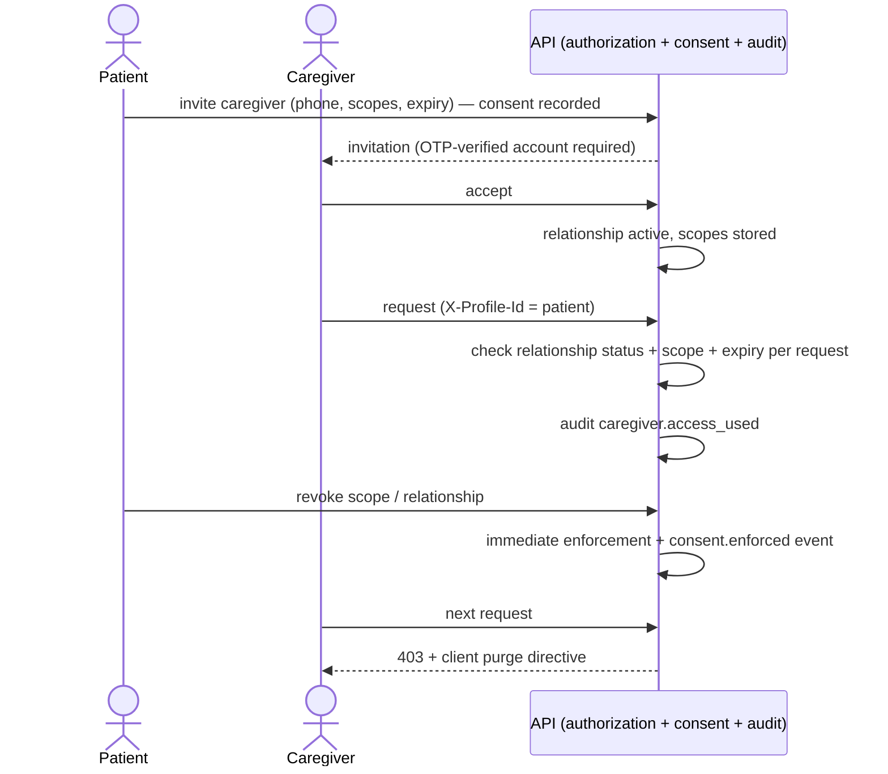

# 18 — Security, Privacy, and Consent

Designed for applicable Indian privacy requirements — the **Digital Personal Data Protection Act (DPDP) 2023** and its rules — plus ABDM policy principles. Health data is treated as highest-sensitivity throughout. Privacy by design and security by design are release gates ([29](29-production-readiness-checklist.md)).

## DPDP alignment map

| DPDP principle | Implementation |
|---|---|
| Consent-based collection & processing | `consents` records with purpose text before any processing; granular types (data processing, each channel, caregiver access, sharing, AI processing, emergency card) |
| Purpose limitation | Consent rows are purpose-bound; authorization layer checks purpose scope; no secondary use without new consent |
| Data minimization | Minimal onboarding fields; optional fields skippable; AI payloads minimized/redacted ([19](19-ai-use-and-guardrails.md)); analytics PHI-free |
| Notice & transparency | Plain-language, localized consent screens; consent register visible to patient (screen 34) |
| Withdrawal / revocation | One-tap revocation with immediate server-side cascade (channels stop, caregivers lose access, shares die) |
| Correction & erasure | Editable records with audit; deletion requests with grace period and coordinated erasure (PG + R2 + shares + derived files), retention obligations honored and disclosed |
| Data portability | Export: patient-readable PDF + machine-readable (FHIR bundle) |
| Children / persons with disability | Dependent profiles managed by verifiable caregiver consent; claimable by the dependent |
| Breach response | Runbook ([30](30-operational-runbooks.md)): contain → assess → notify Data Protection Board + affected users per DPDP timelines → post-incident hazard-log update |
| Data Fiduciary duties | Vendor + subprocessor register (below); DPO/grievance contact (OD-9); cross-border processing documented ([25 §region](25-railway-deployment-architecture.md)) |

**Honest note:** hosting in Railway's Southeast Asia region means cross-border processing of Indian personal data. This is documented, disclosed in the privacy notice, and tracked as OD-2 — a Singapore deployment does **not** automatically satisfy Indian privacy or healthcare obligations; legal review is a launch gate.

## Consent framework

Every access, delegated permission, export, and share is: consent-driven · patient-specific · purpose-bound · revocable · time-bound where appropriate · auditable. Consent state changes are append-only events (`consent_events`) including `enforced` events proving cascade execution. Caregiver flows ([05 J5](05-user-journeys.md)) and sharing flows ([07 screen 29](07-pwa-screen-specifications.md)) ride this framework — enforcement is server-side, never UI-only.

## Security architecture

### Identity & sessions
OTP sign-in (argon2id-hashed OTPs, expiry, attempt/resend limits, enumeration-safe, provider webhook verification, abuse monitoring); opaque session tokens (hashed at rest), rotation on refresh, device-bound listing + revocation; suspicious-login detection (new device + velocity heuristics → step-up OTP); admin accounts: email + password + TOTP MFA mandatory + optional Cloudflare Access in front of `admin-web`.

### Transport & edge
Cloudflare strict TLS; HSTS; security headers (CSP, X-Frame-Options deny, Referrer-Policy `strict-origin-when-cross-origin`, Permissions-Policy minimal); allowed-hostname allowlist; host-header attack prevention; origin restricted to Cloudflare where practical ([26](26-cloudflare-edge-and-r2-architecture.md)).

### Data at rest
Railway PG encryption + **application-level encryption** for direct identifiers (phone, notification addresses, push endpoints) with key rotation support; R2 private buckets, opaque keys, SSE; backups encrypted before leaving PG ([27](27-backup-and-disaster-recovery.md)).

### Application
Zod validation on every input; Prisma parameterization (SQLi); output encoding (XSS); CSRF-safe session pattern (SameSite=Lax httpOnly cookies + custom-header requirement for state changes); idempotency on sensitive writes; rate limits layered (Cloudflare + app + account + device); file-upload validation (signature sniffing, size, quarantine, metadata stripping) ([26 §13.4](26-cloudflare-edge-and-r2-architecture.md)); dependency scanning + secret-leak scanning in CI ([20](20-testing-strategy.md)).

### Least privilege
DB roles: `app_rw` (no DDL), `migrator` (DDL, CI-only), `readonly` (analytics/support, masked views); worker/cron use scoped credentials; R2 API tokens scoped per bucket + operation; admin duties role-based with maker-checker on clinical writes.

### Logging & telemetry hygiene (spec §12.5)
No PHI in URLs, query params, Cloudflare logs, analytics, referrers, breadcrumbs, object names, or cache keys. Never logged: medication/patient names in URLs, prescription contents, OTPs, tokens, session IDs, direct identifiers, unredacted AI prompts/responses. Opaque IDs + digests everywhere; log scrubber middleware enforces + tests assert ([20 secret-leak tests](20-testing-strategy.md)).

## Caregiver access security

## Vendor & subprocessor register

Maintained in `infra/vendor-register.md` (created at first vendor onboarding; template mandated): vendor, service, data shared, region, contract/DPA status, retention, training-use status (AI), exit strategy. Initial entries: Railway (compute/DB), Cloudflare (edge/R2), SMS provider (OD-10), WhatsApp BSP (OD-10), OCR provider (OD-11), AI provider (OD-12), licensed drug DB (OD-3/4).

## Reviews & gates

Security review + privacy review + breach-response tabletop are Stage 11 gates; penetration test before production label; DPDP legal review (OD-2) before launch; this document reviewed quarterly.
