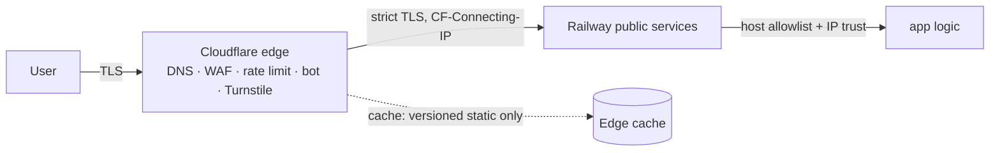
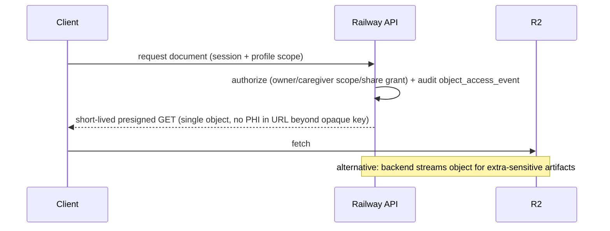

# 26 — Cloudflare Edge and R2 Architecture

Cloudflare's role (spec §7.2, §12, §13): public front door, traffic-security layer, edge-control layer, private object-storage layer. **Never** a second application backend; no authoritative records in KV/D1/DO/Workers storage/Vectorize/edge caches; no Workers AI clinical reasoning; Cloudflare compute only via the §7.2 ADR process.

## DNS and routing

| Hostname | Origin | Notes |
|---|---|---|
| `app.example.com` | Railway patient-web | Proxied, patient + caregiver |
| `api.example.com` | Railway api | Proxied |
| `admin.example.com` | Railway admin-web | Proxied; optional Cloudflare Access policy for internal envs |
| `share.example.com` | Railway patient-web (share routes) | Proxied; aggressive no-store |
| `assets.example.com` | Public static assets | CDN-cached, versioned only |

Rules (spec §12.1): all public traffic proxied; **strict (full) TLS** to origin; Railway-generated domains never exposed to users; hostname allowlist — unexpected hosts rejected at edge and at origin (host-header validation middleware); client IP preserved via `CF-Connecting-IP` (trusted only from Cloudflare ranges); certificate management documented (Cloudflare edge certs + Railway origin certs); origin access restricted where practical (Cloudflare IP allowlisting at origin, ADR if mTLS/tunnel needed later).



## Caching (spec §12.2)

**Cacheable (explicitly, versioned/immutable):** hashed JS/CSS bundles, public icons/app images, marketing content, public localization assets with no patient data. `Cache-Control: public, max-age=31536000, immutable`.

**Never publicly cached:** patient profiles, medication lists, prescriptions + images, safety findings, allergies, conditions, dose records, consent records, secure clinician views, private exports/PDFs, OTP responses, auth tokens, authenticated API responses, caregiver records. All personalized responses ship `Cache-Control: private, no-store` (+ `Pragma: no-cache`); share pages additionally `no-store` with cache rules forcing bypass on `share.example.com/*` and `api.example.com/*`. Staging probes assert `CF-Cache-Status` is never HIT on sensitive routes ([20](20-testing-strategy.md)).

## WAF, rate limiting, bot protection (spec §12.3)

Protected flows: OTP request/verify, login, account recovery, prescription upload, public share access, medication search, export generation, admin login, webhooks, AI explanation, translation, data deletion/export. Layered: Cloudflare managed WAF rules + custom rules → Cloudflare rate limiting (per-IP budgets per flow) → application rate limiting (per-account, per-device) → OTP provider limits → behavioral detection + audit events. **Cloudflare is never the only protection against account takeover or OTP abuse** — application limits stand alone. Security headers set at origin, verified at edge.

## Turnstile (spec §12.4)

Used where it improves abuse resistance: web OTP request, account recovery, public contact forms, suspicious login flows, public share pages (high-velocity access), admin login. Always **verified on the Railway backend** (siteverify). Turnstile ≠ authentication; never on every authenticated request.

## R2 — private object storage (spec §13)

### Buckets

| Bucket | Contents | Lifecycle |
|---|---|---|
| `prod-patient-docs` | prescription/strip/box/bottle images, supporting documents | retained with records; deletion coordinated |
| `prod-derived` | processed derivatives (rotated, thumbnails), generated passports/exports/PDFs | exports expire (7 d); derivatives follow source |
| `prod-ocr-tmp` | temporary OCR inputs/outputs | TTL 48 h |
| `prod-backups` | encrypted DB backup exports, audit archives | per retention policy ([27](27-backup-and-disaster-recovery.md)) |
| `prod-public-assets` | public static assets (only public bucket, behind CDN) | versioned |
| `stg-*` / `dev-*` | full separation per environment | short TTLs |

Never real production patient data in dev/staging buckets. Patient buckets private; access only via short-lived presigned URLs, authenticated backend streaming, or an approved narrow gateway.

### Presigned rules (spec §13.2)
Expire quickly (upload ≤ 10 min, download ≤ 5 min) · created only after authorization · scoped to one object + one operation · unpredictable opaque names · every issuance audited (`object_access_events`) · never in normal logs · content-type restricted · size enforced by app validation + verification.

### Direct upload flow (spec §13.3)

```mermaid
sequenceDiagram
    participant C as Client (browser/native)
    participant API as Railway API
    participant R2 as R2 (private)
    participant W as Worker
    C->>API: 1. request upload authorization (type, size, kind)
    API->>API: 2–5. authN → permission → pending prescription_document + stored_object → opaque key
    API-->>C: 6. presigned PUT (short-lived)
    C->>R2: 7. direct upload
    C->>API: 8. report completion
    API->>R2: 9–10. verify object exists; validate type (signature), size, checksum
    API->>API: 11. mark verified
    API->>W: 12. queue OCR/processing
    W->>R2: 13. private fetch
    W->>API: 14. results → PostgreSQL
    W->>R2: 15. approved derivatives → prod-derived
    Note over API: Client completion claims are never trusted without verification
```

### Secure download flow



### Validation (spec §13.4)
Restrict types (JPEG/PNG/HEIC/PDF) · verify magic-byte signatures · enforce size limits · opaque identifiers · record checksums · malware scan where practical (worker-based scanner, OD) · strip EXIF/metadata (keep orientation, apply safely) · reject unsupported formats · quarantine suspicious files (`stored_objects.status=quarantined`) · preserve originals where required · record transformations · derivatives stored separately.

### Naming (spec §13.5)
No patient identifiers in bucket names, object keys, URLs, paths, or infra-visible filenames. Keys: `{kind}/{yyyy}/{mm}/{uuidv7}` — relationships live only in PostgreSQL. **No permanent public R2 URLs stored anywhere.**

### Lifecycle and deletion (spec §13.6)
Lifecycle rules per bucket table above plus: expired share artifacts, revoked shares (snapshot objects deleted on revoke), deleted accounts (grace → coordinated purge), abandoned uploads (24 h), orphan reconciliation cron (objects without DB rows and rows without objects). Deletion coordinates: PostgreSQL records ↔ R2 objects ↔ retention requirements ↔ backup retention (documented: backups age out naturally; deletion log preserves proof) ↔ share revocation ↔ audit obligations ↔ derived files ↔ export status.

## Edge security events

WAF/rate-limit/bot events reviewed in Cloudflare dashboards, exported periodically for correlation ([21](21-observability-and-audit.md)). No PHI reaches edge logs by construction (opaque URLs, no PHI in query strings).
