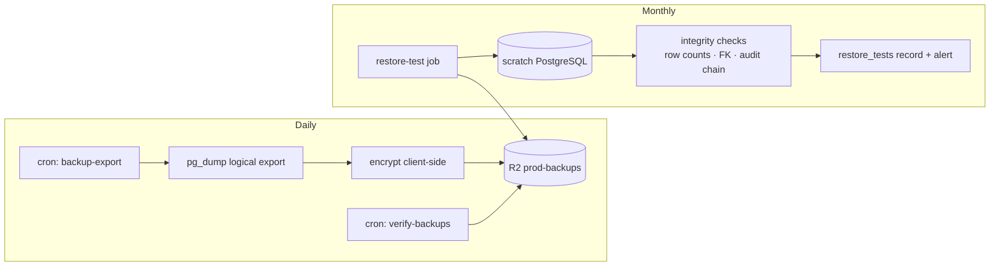

# 27 — Backup and Disaster Recovery

Non-negotiable: **backups are not valid until restoration is tested** (spec §30). `backup_executions` + `restore_tests` tables record every run; a backup without a passing restore test does not count toward RPO.

**Built and live-verified this session (Stage 11 follow-up):** `backup-export` (daily 01:00) runs a real `pg_dump` (custom format), encrypts it client-side (AES-256-GCM, a dedicated `BACKUP_ENCRYPTION_KEY` — deliberately separate from `FIELD_ENCRYPTION_KEY`, a different trust boundary) before it ever leaves Postgres, uploads to R2's `backups` bucket, and records a per-table row-count manifest. `verify-backups` (daily 03:00) independently re-downloads and re-hashes the latest backup, checking freshness/size/checksum. `restore-test` (monthly) decrypts the latest backup, restores it via `pg_restore` into a genuine scratch database on the same Postgres server (`CREATE DATABASE`/`DROP DATABASE`, never touching the real app database), and compares every table's restored row count against the manifest.

Live-verified against the real deployed Railway environment (not just locally): a real backup ran (50 tables, ~137KB encrypted), `verify-backups` confirmed it fresh/present/checksum-matched, and `restore-test` restored it into a scratch database and confirmed all row counts matched (`row_counts_match: true`) — the scratch database was then dropped as designed. This is the first real evidence that `backup_executions`/`restore_tests` exist and a passing restore test actually happened, per this doc's own non-negotiable framing above.

Not yet built: encryption key custody outside Railway (the key currently lives in Railway variables, not a separate KMS/age setup — docs/27's original "keys held outside Railway" framing isn't fully met yet); R2 cross-bucket sync/versioning for `patient-docs`/`derived`; the quarterly region-loss game day; Railway's own PITR configuration (not verified this pass — this covers the independent `pg_dump` path only).

## Objectives (initial; revisit at launch)

| Metric | Target |
|---|---|
| RPO (data loss tolerance) | ≤ 24 h from logical exports; ≤ 5 min where Railway PITR is available |
| RTO (service restoration) | ≤ 4 h same-region incident; ≤ 24 h region loss |

## What is backed up

| Asset | Method | Cadence | Retention |
|---|---|---|---|
| PostgreSQL | Railway automated backups + PITR where available | provider cadence | provider window |
| PostgreSQL (independent copy) | `pg_dump` logical export from cron → **client-side encrypted (age/KMS key)** → `prod-backups` R2 | daily 01:00 | 30 daily, 12 monthly |
| R2 patient/derived buckets | R2 versioning + cross-bucket sync of critical prefixes | continuous/daily | 30 d versions |
| Audit archive | append-only export to `prod-backups` | monthly | ≥ 7 y (OD-7) |
| Configuration | `infra/` in git; Railway/Cloudflare settings exported quarterly | on change | git history |
| Secrets | manager of record ([28](28-environment-and-secrets-strategy.md)); sealed break-glass copy | on change | current |

Backup exports contain PHI ⇒ encrypted before leaving PG, keys held outside Railway, access audited.

## Verification

- `verify-backups` cron (03:00): checksums, size sanity, freshness — alerts on failure.
- **Monthly restore test** (staging, automated): fetch latest export → decrypt → restore into scratch PG → integrity checks (row counts vs manifest, FK validity, audit hash-chain verification, sampled decrypt of encrypted columns) → record `restore_tests` row → alert on failure. A failed restore test is a P2 incident.
- Quarterly manual game-day: full region-loss walkthrough on staging.

## Backup and restore flow

## Disaster scenarios

| Scenario | Response (runbook detail in [30](30-operational-runbooks.md)) |
|---|---|
| Bad deploy / data-corrupting bug | Rollback image; PITR to pre-incident point if data corrupted; replay-safe jobs re-run |
| PG instance loss | Restore Railway backup/PITR; if unavailable, latest verified R2 export (accept RPO); workers rebuild queues from PG |
| Redis loss | No data loss by design (PG is truth); queues rebuilt from `background_jobs`/`scheduled_doses`; idempotency prevents duplicate sends |
| R2 object loss/corruption | Restore from version history / sync copy; reconcile `stored_objects` |
| Railway region loss | Provision project in alternate region from `infra/` config; restore PG from R2 export; repoint Cloudflare DNS (low TTL); accept documented RPO/RTO; **limitation documented: no hot standby in MVP** |
| Cloudflare outage | Documented limitation: edge outage = public outage (origins not directly exposed by design); status-page comms |
| Account compromise (Railway/Cloudflare) | Break-glass: rotate tokens, review audit, restore config from git |

## Restore-order dependency

1. PostgreSQL → 2. Secrets/config → 3. API + web (verify health) → 4. Redis (empty is fine) → 5. Workers/cron (idempotent catch-up: missed-dose reconciliation, stuck-job reconciliation) → 6. R2 verification pass → 7. Post-restore checks: auth flow, medication read/write, reminder pipeline dry-run, audit chain continuity, backup job re-armed.

Recovery and migration procedures for the region decision are part of the §11.9 documentation set ([25](25-railway-deployment-architecture.md)).
