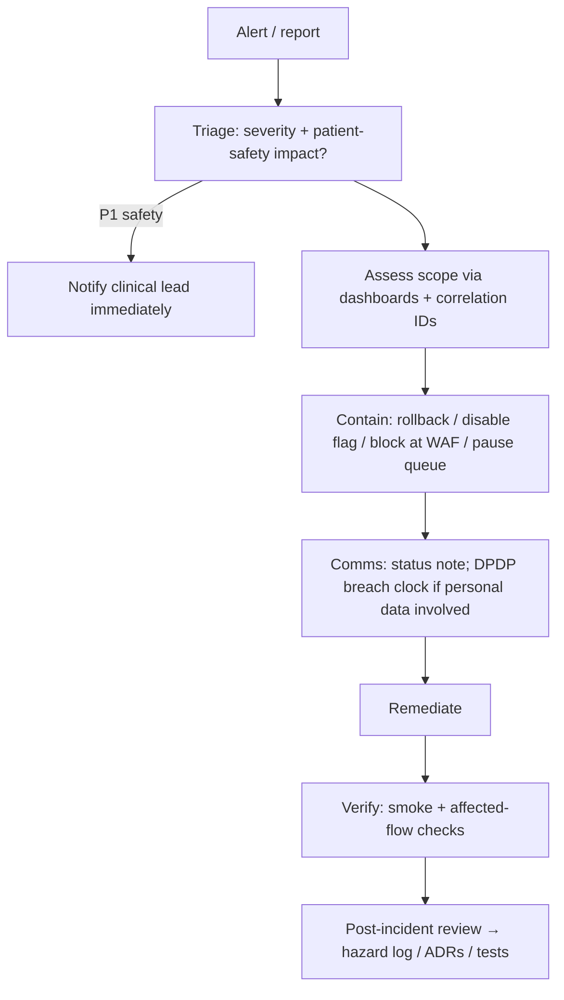

# 30 — Operational Runbooks

On-call: business-hours rota initially; paging via monitoring alerts ([21](21-observability-and-audit.md)). Severity: **P1** patient-safety-relevant or full outage · **P2** degraded core function · **P3** partial/non-core · **P4** cosmetic. Every incident gets a record (timeline, impact, actions) and a post-incident review that updates the hazard log where clinically relevant.

## Incident response flow

## Runbooks

### R1 — API down / error spike
Check Railway service status + recent deploys → rollback last image if correlated → check PG connections (exhaustion? locks?) and Redis → `/readyz` diagnostics → if upstream (Cloudflare) verify edge status → escalate P1 if > 15 min.

### R2 — Reminder pipeline failure (P1-capable: missed medication reminders)
Dashboards: queue depth, DLQ, provider error rates → if cron stalled: check `reconcile-stuck-jobs`, run manual dispatch for the window (idempotent — dedupe keys prevent double-send) → if provider down: verify fallback channels engaged; if all SMS/WhatsApp down, in-app + push continue; log incident for delivery-metric review → after recovery run missed-dose reconciliation.

### R3 — Worker DLQ growth
Inspect DLQ payload digests → classify (poison message vs downstream outage) → fix cause → replay via admin job-replay endpoint (idempotent jobs) → confirm `background_jobs` completion → add regression test.

### R4 — PostgreSQL incidents
*Connection exhaustion:* identify offender via `pg_stat_activity`, reduce pool/replicas, kill runaways. *Slow queries/locks:* `pg_stat_statements` review, index or query fix. *Storage:* growth dashboard, retention crons, emergency scale. *Corruption/bad migration:* stop writes → PITR/restore per [27](27-backup-and-disaster-recovery.md) → verify audit chain continuity.

### R5 — Redis loss
Confirm PG unaffected → restart/replace Redis → queues rebuild from PG (`scheduled_doses`, `background_jobs`) → verify no duplicate notifications (dedupe keys) → sessions: users re-authenticate if session cache affected (server-side sessions are in PG; Redis holds only short-lived state).

### R6 — R2 unavailable / object issues
Uploads: clients defer with retry (no data loss — pending documents reconcile) → downloads: serve outage message → *missing object:* check `stored_objects` vs R2, restore from version history, reconcile → *orphaned objects:* cleanup cron + manual reconcile script.

### R7 — Security events
*OTP abuse/credential stuffing:* review WAF + `auth.*` audit anomalies → tighten Cloudflare rate rules → block ASN/IP ranges → verify app-level limits held. *Suspected breach:* isolate (rotate affected credentials, revoke sessions) → preserve evidence (audit chain) → DPDP notification assessment with legal (clock starts at awareness) → user notification per obligation → PIR + hazard log.

### R8 — Secret leak
Rotate immediately (runbook per secret in [28](28-environment-and-secrets-strategy.md)) → gitleaks history scan → audit usage of leaked credential → assess data exposure → if PHI reachable: treat as R7 breach path.

### R9 — Share-link abuse
Revoke link(s) via admin tools → review `share_access_events` → notify patient → tighten share rate limits/Turnstile on `share.example.com`.

### R10 — Bad deploy
Rollback to previous image (Railway) → if migration involved: assess forward-fix vs down-migration (down only if data-safe; else restore path) → post-deploy smoke → PIR on why gates missed it.

**Rehearsed this session (Stage 11):** the "roll forward" path — commit a fix, push, Railway auto-builds and redeploys from the new commit — was exercised for real dozens of times this session (every deploy fix along the way), always successfully, and is the primary, proven recovery path. "Rollback to previous image" specifically (redeploying a named *older* deployment without a new commit) is a real Railway dashboard feature but isn't exposed by the CLI (`railway redeploy`/`railway deployment redeploy` only ever redeploy the *latest* deployment, or pull fresh from source with `--from-source` — neither accepts a target deployment ID) — so that specific action needs the Railway web dashboard, not automatable from here. Documented honestly rather than claimed as tested.

### R11 — Clinical content / safety-rule error (P1)
Immediately unpublish content version / disable rule version (versioned system enables instant revert) → clinical lead assesses patient exposure via evaluation records (traceability: which patients saw which rule version) → corrective notification to affected patients if clinically warranted (clinical lead decision) → hazard log + Gate re-run.

### R12 — Backup/restore-test failure
Treat as P2 → diagnose (encryption key? size? export job?) → re-run manually → if unrecoverable, escalate: the system is out of DR compliance until a verified backup exists.

### R13 — Cloudflare misconfiguration (cache/WAF)
*Sensitive route cached:* purge cache immediately → fix rule → probe `CF-Cache-Status` → incident review (privacy assessment: what was served to whom). *WAF false positives blocking patients:* identify rule via firewall events → adjust with narrowest scope → add probe test.

## Routine operations

Weekly: DLQ review, alert-quality skim, dependency updates triage, cost snapshot. Monthly: restore-test review, access review (Railway/Cloudflare/admin accounts), secret-age report. Quarterly: index review, hazard-log review, game day, vendor register review.
